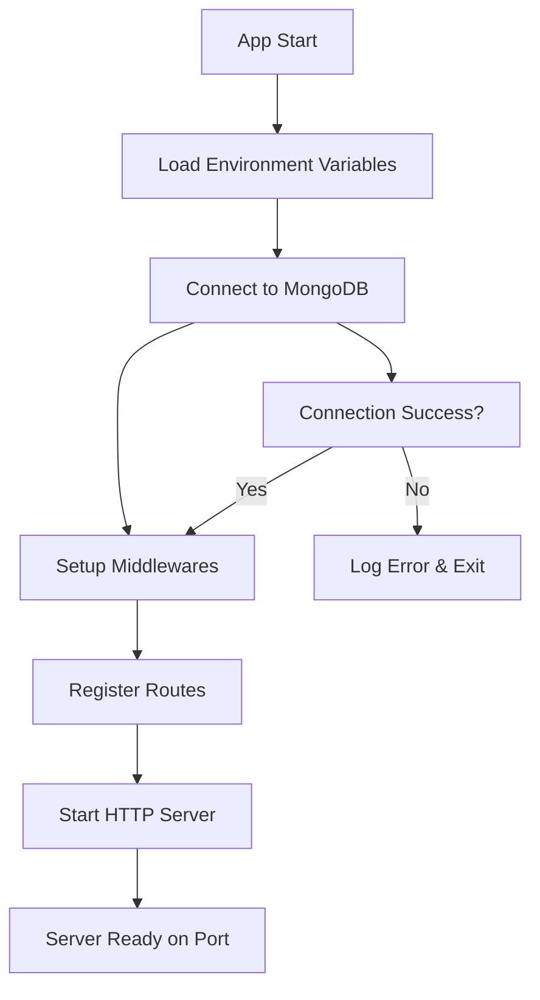
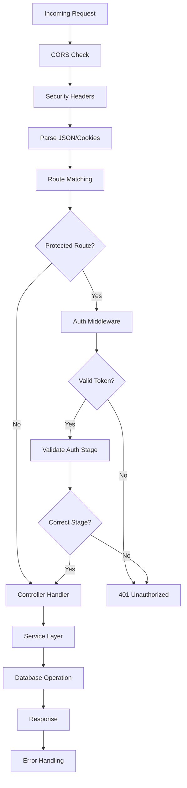
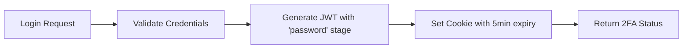
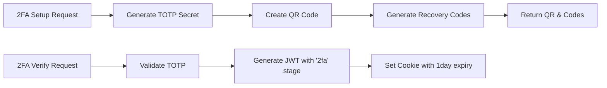
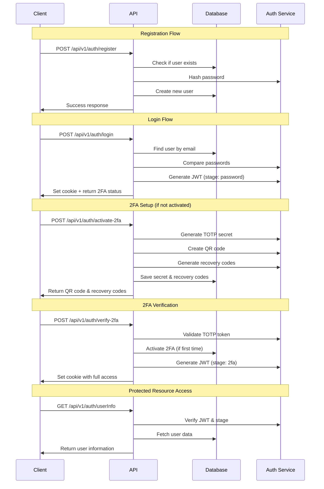

# Plant Disease Backend API

A secure Node.js/Express backend API for plant disease detection with two-factor authentication (2FA) support.

## 🚀 Quick Start

```bash
# Install dependencies
npm install

# Set up environment variables
cp .env.example .env

# Start development server
npm run dev

# Build for production
npm run build

# Start production server
npm start
```

## 📋 Table of Contents

- [Architecture Overview](#architecture-overview)
- [Application Flow](#application-flow)
- [Authentication System](#authentication-system)
- [API Endpoints](#api-endpoints)
- [Project Structure](#project-structure)
- [Environment Setup](#environment-setup)
- [Security Features](#security-features)

## 🏗️ Architecture Overview

```
┌─────────────────┐    ┌─────────────────┐    ┌─────────────────┐
│   Client App    │───▶│   Express API   │───▶│   MongoDB       │
│                 │    │                 │    │                 │
│ - React/Vue/etc │    │ - Routes        │    │ - User Data     │
│ - HTTP Requests │    │ - Controllers   │    │ - Auth Info     │
│ - Cookie Auth   │    │ - Services      │    │ - 2FA Secrets   │
└─────────────────┘    └─────────────────┘    └─────────────────┘
```

### Tech Stack
- **Runtime**: Node.js with TypeScript
- **Framework**: Express.js
- **Database**: MongoDB with Mongoose
- **Authentication**: JWT + 2FA (TOTP)
- **Security**: Helmet, CORS, bcrypt
- **Logging**: Winston
- **Validation**: Joi

## 🔄 Application Flow

### 1. Server Startup Flow



### 2. Request Processing Flow



## 🔐 Authentication System

The app uses a **two-stage authentication system**:

### Stage 1: Password Authentication


### Stage 2: Two-Factor Authentication


### Complete Authentication Flow



## 📡 API Endpoints

### Public Endpoints
| Method | Endpoint | Description |
|--------|----------|-------------|
| `POST` | `/api/v1/auth/register` | Register new user |
| `POST` | `/api/v1/auth/login` | Login with email/password |

### Protected Endpoints (Password Stage)
| Method | Endpoint | Description | Auth Stage |
|--------|----------|-------------|------------|
| `POST` | `/api/v1/auth/activate-2fa` | Setup 2FA | `password` |
| `POST` | `/api/v1/auth/verify-2fa` | Verify 2FA code | `password` |

### Protected Endpoints (Full Access)
| Method | Endpoint | Description | Auth Stage |
|--------|----------|-------------|------------|
| `GET` | `/api/v1/auth/userInfo` | Get user profile | `password` + `2fa` |
| `PUT` | `/api/v1/auth/logout` | Logout user | `password` + `2fa` |

### System Endpoints
| Method | Endpoint | Description |
|--------|----------|-------------|
| `GET` | `/` | API status check |
| `GET` | `/health` | Health check |

## 📁 Project Structure

```
src/
├── app.ts                 # Main application entry point
├── config/
│   ├── index.ts          # Environment configuration
│   └── db.ts             # Database connection
├── controller/
│   └── auth.controller.ts # Request handlers
├── services/
│   └── auth.service.ts   # Business logic
├── repositories/
│   └── user.repository.ts # Database operations
├── middlewares/
│   ├── auth.middleware.ts # Authentication middleware
│   └── error.middleware.ts # Error handling
├── routes/
│   ├── index.ts          # Route aggregator
│   └── auth.routes.ts    # Authentication routes
├── models/               # Database schemas
├── validators/           # Input validation
├── helpers/              # Utility functions
├── utils/                # Common utilities
├── types/                # TypeScript type definitions
└── interfaces/           # TypeScript interfaces
```

## 🔧 Environment Setup

Create a `.env` file in the root directory:

```env
# Server Configuration
NODE_ENV=development
PORT=5000
API_PREFIX=/api/v1

# Database
MONGODB_URI=mongodb://localhost:27017/plant-disease-db

# JWT Secrets
JWT_SECRET=your-super-secret-jwt-key
JWT_REFRESH_SECRET=your-super-secret-refresh-key

# Client Configuration
CLIENT_URL=http://localhost:3000
CORS_ORIGIN=http://localhost:3000

# Logging
LOG_LEVEL=info


```

## 🛡️ Security Features

### 1. Authentication Security
- **JWT Tokens**: Secure token-based authentication
- **Two-Factor Authentication**: TOTP-based 2FA with QR codes
- **Recovery Codes**: Backup codes for 2FA recovery
- **Password Hashing**: bcrypt with salt rounds
- **Cookie Security**: HttpOnly, Secure, SameSite cookies

### 2. Application Security
- **Helmet**: Security headers protection
- **CORS**: Cross-origin request protection
- **Input Validation**: Joi schema validation
- **Rate Limiting**: Built-in Express rate limiting
- **Error Handling**: Centralized error management

### 3. Database Security
- **Connection Security**: Secure MongoDB connection
- **Data Validation**: Mongoose schema validation
- **Sensitive Data**: Excluded from responses by default

## 🚦 How It All Works Together

### 1. **Startup Process**
   - App loads environment variables
   - Connects to MongoDB database
   - Sets up security middlewares (CORS, Helmet)
   - Registers API routes
   - Starts HTTP server

### 2. **Request Lifecycle**
   ```
   Request → Security Checks → Route Matching → Auth Check → Controller → Service → Database → Response
   ```

### 3. **Authentication Stages**
   - **Stage 1 (password)**: Basic login, limited access (5 min)
   - **Stage 2 (2fa)**: Full access after 2FA verification (1 day)

### 4. **Error Handling**
   - All errors are caught and processed by error middleware
   - Consistent error response format
   - Detailed logging for debugging

### 5. **Data Flow**
   ```
   Client Request → Controller (validation) → Service (business logic) → Repository (database) → Response
   ```

## 🔍 Key Components Explained

### Controllers
Handle HTTP requests, validate input, and coordinate responses.

### Services
Contain business logic, authentication, and data processing.

### Repositories
Manage database operations and data access patterns.

### Middlewares
Process requests before they reach controllers (auth, validation, etc.).

### Helpers & Utils
Provide reusable functions for encryption, JWT, logging, etc.

---

This backend provides a solid foundation for secure user authentication with modern security practices. The two-stage authentication system ensures both security and user experience are optimized.